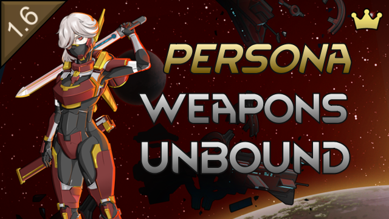

# Persona Weapons Unbound

> A RimWorld mod for customizing Royalty's persona (bladelink) weapons

## About

RimWorld's Royalty DLC introduced bladelink weapons — player-facing: **persona weapons** — the persona monosword, persona plasmasword, and persona zeushammer. Each carries an onboard AI persona with 1–2 weapon traits and bonds permanently to the first pawn who equips it. In vanilla, persona weapons only come from Empire traders, quest rewards, and relics — and you're stuck with whatever traits they rolled.

This mod lets you take control. Add and remove persona traits, rename the persona, and convert base weapons to and from their persona variants — all at a fabrication bench, with research gating and configurable balance settings.

## Features

### Trait Customization

- **Add traits** to a base monosword/plasmasword/zeushammer, converting it into its persona variant — the first trait costs an **AI persona core**, physically installed
- **Remove traits** from existing persona weapons; removing the **last trait** reverts the weapon to its base form and **refunds the persona core**
- **Full trait validation** respecting vanilla rules — max trait count, exclusion-tag conflicts, sole-trait restrictions
- **Reprogramming cost model**: every other trait change (add or remove) costs advanced components that scale with weapon quality above a configurable threshold — reprogramming a persona is destructive, so neither direction refunds

### Rename

- **Rename** the persona using vanilla's bladelink namer, or type your own. Ideology relic names stay locked per Ideology rules

### Royalty DLC Integration

- **Bonding respected**: bonded hediffs/thoughts are applied and removed alongside their trait; adding the free-wielding trait severs an existing bond (with warning); reverting a bonded weapon to its base form severs the bond (with confirm warning)
- **Relic handling**: Ideology relics can be customized while preserving relic status; their names stay locked and are only changed through ideology reform

### Multiple Entry Points

- **Weapon gizmo**: select a persona (or convertible base) weapon and click "Customize persona", then choose a colonist
- **Workbench right-click**: right-click a fabrication bench with a colonist selected to customize their equipped or carried weapons
- **Ground weapon right-click**: right-click a weapon on the ground to send a colonist to the nearest operational fabrication bench

### Workbench & Research

- **Static fabrication bench**: persona weapons are all ultratech, so there's no workbench tier system — customization happens at the fabrication bench (or a VEF-recognized equivalent, e.g. VFE's compact fabrication bench)
- **Single research project**: "Bladelink Customization" (ultratech tier, gated behind Advanced Fabrication, one Empire-sourced techprint by default) gates customization and the crafting recipes below
- **Job-based system**: each trait or cosmetic change is a separate crafting job — interrupt safely without losing resources

### Crafting Recipes

Persona weapons' base variants aren't craftable in vanilla. With Bladelink Customization researched, the fabrication bench offers craftable base monoswords, plasmaswords, and zeushammers (each individually toggleable in settings) — craft the base weapon, then install a persona core through customization for a fully in-colony path to a bespoke persona weapon.

An optional persona core recipe (**off by default**, since vanilla only ever lets you find or trade for one) closes the last gap in that loop: 20 advanced components at the fabrication bench, Crafting 18, gated behind vanilla's machine persuasion research. Both the component count (5–30) and the skill requirement (0–20) are sliders.

### Mod Settings

All balance levers are configurable from the in-game mod settings:

- **Persona cost sliders** — base component cost per trait change, the quality tier at which a surcharge kicks in, and the surcharge per quality level above it, with a live cost table
- **Techprint count** (0–3) — how many Empire techprints the research requires; 0 removes the requirement entirely, no restart needed
- **Crafting recipe toggles** — enable/disable each of the three base weapon recipes independently, plus the optional persona core recipe (off by default) with its own component-cost and skill-requirement sliders
- **Minimum weapon quality** — restrict customization to weapons at or above a quality threshold
- **Trait discovery progression** — optionally restrict available traits to those seen on persona weapons held by the colony, in caravans, or on hostiles
- **Trait limit / sole-trait enforcement** — optionally enforce vanilla's generation restrictions during customization
- **Ingredient hauling** — choose between Sequential (vanilla-equivalent), Sweep, and Thorough haul planners

### Mod Compatibility

Designed for automatic compatibility with modded persona weapons and traits — any `ThingDef` with `CompBladelinkWeapon` and a resolvable base/persona pairing participates automatically, as does any trait with `weaponCategory == BladeLink`. No hard-coded def references.

## Requirements

- **RimWorld 1.6** or later
- **Royalty DLC** (required — depends on Royalty's bladelink weapon system)
- **Harmony** (auto-download from Steam Workshop if you don't have it)

## Installation

### Steam Workshop (Recommended)

Subscribe on the Steam Workshop and it will auto-download.

### Manual Installation

1. Download the latest release from the [Releases](https://github.com/sam-hunt/PersonaWeaponsUnbound/releases) page
2. Extract the `PersonaWeaponsUnbound` folder to your RimWorld `Mods` directory:
   - **Windows**: `C:\Program Files (x86)\Steam\steamapps\common\RimWorld\Mods\`
   - **Mac**: `~/Library/Application Support/Steam/steamapps/common/RimWorld/RimWorldMac.app/Mods/`
   - **Linux**: `~/.steam/steam/steamapps/common/RimWorld/Mods/`
3. Enable the mod in RimWorld's mod menu
4. Restart RimWorld

## Compatibility

- **Safe to add** to existing saves.
- **Safe to remove** from saves (no persistent game state modifications — converted weapons simply revert to plain Royalty defs).
- **Coexists with [Unique Weapons Unbound](https://github.com/sam-hunt/UniqueWeaponsUnbound)** (this mod's sibling for Odyssey unique weapons): disjoint packageId, Harmony ID, assembly, namespaces, defNames, and localization keys, with complementary trait filters — UWU handles Odyssey unique weapons, PWU handles Royalty persona weapons.
- **VEF**: benches that inherit recipes from the fabrication bench (e.g. VFE's compact fabrication bench) are automatically recognized as customization benches.

## Contributing

Bug reports and feature requests welcome on [GitHub Issues](https://github.com/sam-hunt/PersonaWeaponsUnbound/issues).
Please attach any relevant logs/stack traces/mod lists etc.

For development setup, see [CLAUDE.md](CLAUDE.md).

## Credits

**Author**: Sam Hunt ([@sam-hunt](https://github.com/sam-hunt))

Forked from [Unique Weapons Unbound](https://github.com/sam-hunt/UniqueWeaponsUnbound), which customizes Odyssey's unique weapons — check it out if you play with Odyssey.

**Built With**:

- [Harmony](https://github.com/pardeike/Harmony) by Andreas Pardeike - Runtime patching library
- RimWorld modding API, community examples

**Special Thanks**:

- [Ludeon Studios](https://ludeon.com) for RimWorld and modding API
- [The RimWorld modding community](https://steamcommunity.com/app/294100/workshop/) for inspiration and working examples
- [Claude Code](https://claude.com/claude-code) for `monodis`, `ilspycmd` and C#
